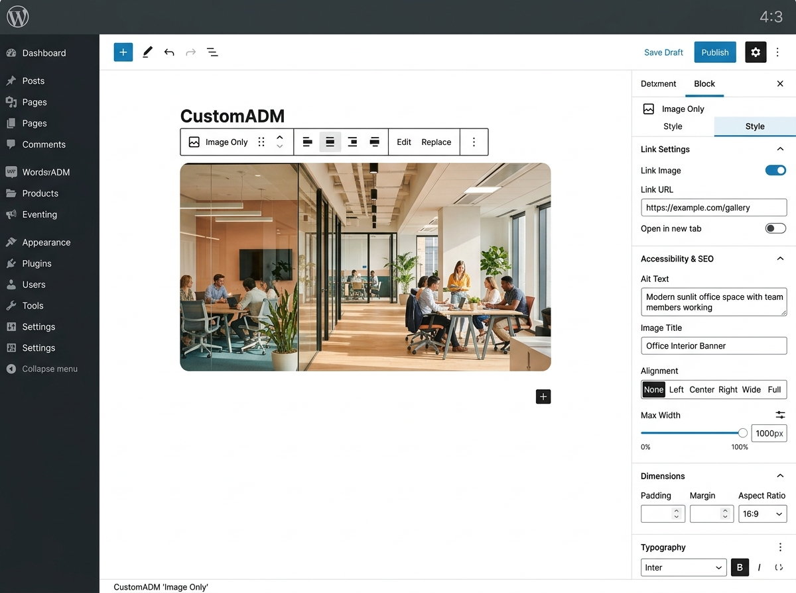

# CustomADM - Image Only (`custom-adm/image-only`)

[](https://wordpress.org)
[](https://wordpress.org/gutenberg/)
[](https://developer.mozilla.org)
[](https://www.gnu.org/licenses/gpl-2.0.html)

Bloco customizado Gutenberg para exibição direta de imagem isolada (banners promocionais, logos institucionais, selos de qualidade, avisos ou imagens pontuais) com link opcional, controle de alinhamento, largura máxima e atributos de acessibilidade/SEO.

Desenvolvido em **JavaScript Vanilla (ES5)**, sem necessidade de etapas de compilação (sem Webpack, Babel ou npm), seguindo estritamente a arquitetura dos blocos do ecossistema **customADM** / **luiz0067**.



---

## 📁 Estrutura de Arquivos

```text
luiz0067-image-only/
├── assets/
│   └── screenshot-1.png          # Banner de divulgação do plugin (1200x900px)
├── css/
│   ├── editor.css                # Estilos visuais exclusivos do editor Gutenberg
│   └── style.css                 # Estilos frontend (alinhamentos, responsividade e hover)
├── js/
│   └── blocks/
│       └── image-only.js         # Implementação ES5 Vanilla do bloco (edit e save)
├── languages/
│   └── custom-adm-image-only.pot # Arquivo modelo de tradução (Gettext)
├── image-only.php                # Registro do plugin, assets e integração com hooks do WP
├── README.md                     # Documentação completa
└── screenshot-1.png              # Pré-visualização do bloco (1200x900px)
```

---

## ⚙️ Atributos do Bloco

| Atributo | Tipo | Padrão | Descrição |
| :--- | :--- | :--- | :--- |
| `imageUrl` | `string` | `''` | URL da imagem selecionada na Biblioteca de Mídia do WordPress |
| `imageId` | `number` | `0` | ID da imagem no WordPress (`wp_posts`) |
| `altText` | `string` | `''` | Texto alternativo para acessibilidade e leitores de tela |
| `url` | `string` | `''` | URL de redirecionamento ao clicar na imagem |
| `targetBlank` | `boolean` | `false` | Se verdadeiro, abre o link em uma nova aba (`_blank`) |
| `alignment` | `string` | `'center'` | Alinhamento do bloco: `left`, `center` ou `right` |
| `maxWidth` | `string` | `'100%'` | Largura máxima personalizada (ex.: `100%`, `600px`, `320px`, `40rem`) |

---

## 🚀 Instalação e Ativação

1. Clone ou baixe este repositório dentro da pasta de plugins do WordPress:
   ```bash
   cd wp-content/plugins/
   git clone https://github.com/luiz0067yahoo/luiz0067-image-only.git luiz0067-image-only
   ```
2. Acesse o Painel Administrativo do WordPress: **Painel > Plugins > Plugins Instalados**.
3. Localize **CustomADM - Image Only** e clique em **Ativar**.
4. Abra ou crie um post ou página no editor Gutenberg.
5. Pesquise por **"Imagem Simples"** ou **"Image Only"** e insira o bloco na página.

---

## 🌐 Internacionalização (i18n)

O bloco suporta internacionalização completa por meio de `wp.i18n.__` no JavaScript e `__()` no PHP, utilizando o textdomain `custom-adm`.

Idiomas mapeados:
- 🇧🇷 **Português do Brasil (`pt_BR`)**
- 🇺🇸 **Inglês (`en_US`)**
- 🇪🇸 **Espanhol (`es_ES`)**
- 🇮🇹 **Italiano (`it_IT`)**

---

## 📄 Licença

Distribuído sob a licença **GPL-2.0-or-later**.
